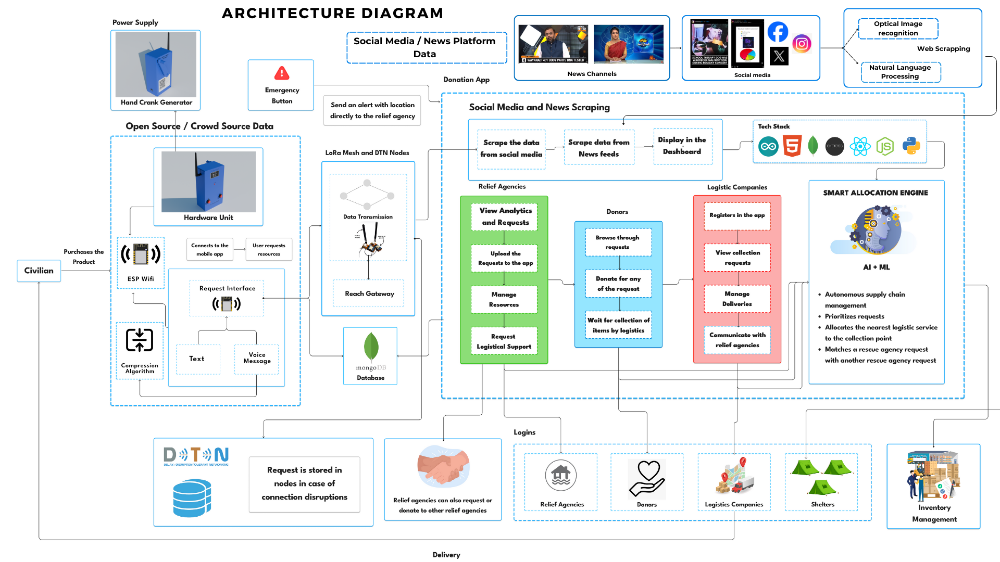
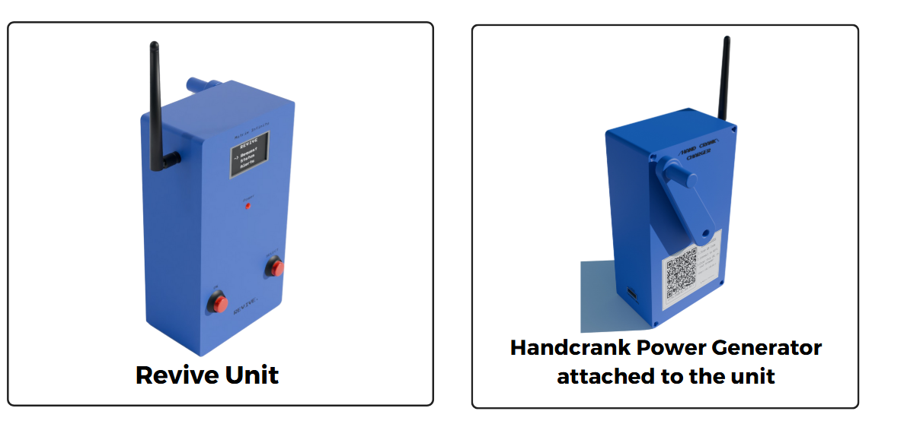
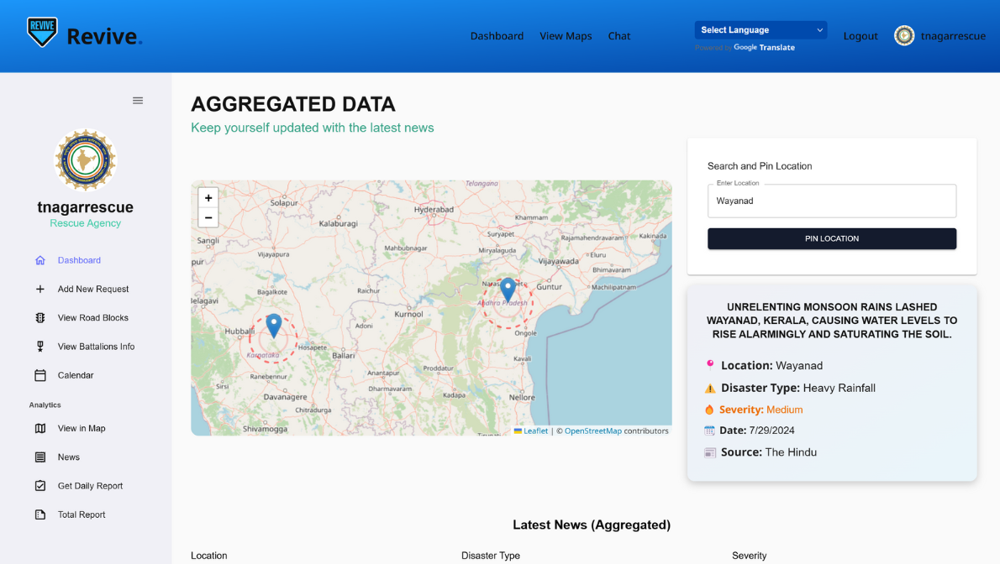
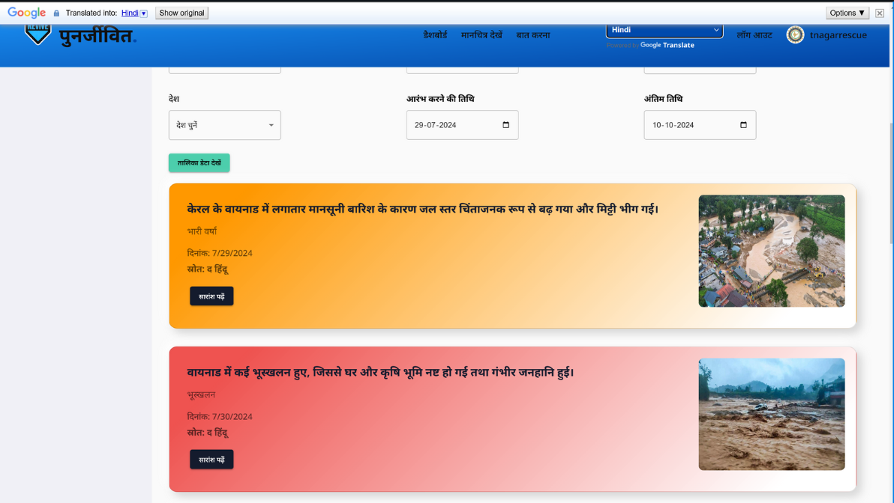
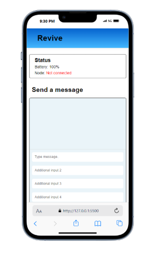

# 🌐 Revive – Revolutionizing Disaster Management

> A project by Team **Matrix Infinity** for the **Google Solutions Challenge**

## 🚨 Problem Statement

Disaster response agencies in India lack effective systems to gather and act on real-time data during disaster times. This inadequacy leads to loss of human life as well as irreparable damage. A Solution is required which enables rescue teams to communicate effectively even during disasters to save lives efficiently.

## 💡 Our Solution – Revive

**Revive** is a hybrid disaster management solution that:
- Aggregates real-time data from social media, news, and public reports
- Enables real-time data transmission through emergency-ready communication nodes
- Provides rescue teams with a live dashboard to monitor and manage disaster responses
- Allows civilians to report events, request supplies, and send SOS signals during disaster
- Facilitates public donations and logistics coordination

---

## 🔁 Three-Phase Disaster Coverage

### 🟩 Pre-Disaster
- Social media and news scraping
- AI-powered disaster-type and location categorization
- Rescue dashboard for early alerts

### 🟧 Mid-Disaster
- Revive communication units deployed
- Civilians report and request via mobile interface
- Data sent over LoRa mesh network through access points

### 🟥 Post-Disaster
- Continued data aggregation
- Crowd-sourced damage reports
- Donation tracking and logistics for efficient recovery

---

## 🔧 Technical Architecture


- ⚛️ **React.js** – For building dynamic and responsive user interfaces for the web dashboard and mobile-friendly views.
- 🌐 **Express.js** – Backend API server to handle requests, integrate data pipelines, and manage communication between frontend and database.
- 🍃 **MongoDB** – NoSQL database to store real-time disaster reports, user requests, news data, and donation records.
- 🗺️ **Google Maps API** – To visualize disaster locations, live reports, and rescue efforts on an interactive map interface.
- 🤖 **Gemini AI (by Google)** – For advanced natural language understanding and data extraction from image and videos, and to categorize and tag disaster-related content from social media and news feeds.


---

## 📸 Screenshots





---

**Repository Structure:**
| Directory   | Description              |
| ------------- | ------------------------------------- |
| /api   | Houses the backend codebase developed with MongoDB and the server side code with express.js. |
| /client   | Contains the frontend codebase built with React.js. |


---

## Getting Started


1. **Clone the repository:**
   ```bash
   git clone https://github.com/Vishaal19fl/revive-matrix-infinity
   ```

2. **Install dependencies:**
   ```bash
   cd revive-matrix-infinity
   npm install
   ```

3. **Set up environment variables:**
   Create a `.env` file in the root directory and add the following:
   ```
   PORT=3000
   MONGO=your-mongodb-uri
   CLOUDINARY_API_KEY=your-cloudinary-api-key
   CLOUDINARY_API_SECRET=your-cloudinary-api-secret
   ```

4. **Start the backend server:**
   ```bash
   cd api
   yarn start
   ```
   
5. **Start the frontend server:**
   ```bash
   cd client
   yarn dev --host
   ```   

6. **Open your browser:**
   Navigate to http://localhost:3000 to view the application.

Make sure to replace `your-mongodb-uri`, `your-cloudinary-api-key`, and `your-cloudinary-api-secret` with your actual MongoDB URI and Cloudinary API credentials. This will ensure proper functioning of the application.

---

**Team:**
| Name      | GitHub Username |
| -------------- | --------------- |
| Vishaal Krishna    | @Vishaal19fl    |
| Sharvesh A R     | @Shxrvxshar7    |
| Surya Prakash G  | @surya-prakash047 |
| Vishaal S    | @Vishaal-Sathya    |
| Mentor     | Rakesh Kumar (@RakeshMahi)  |  

---


